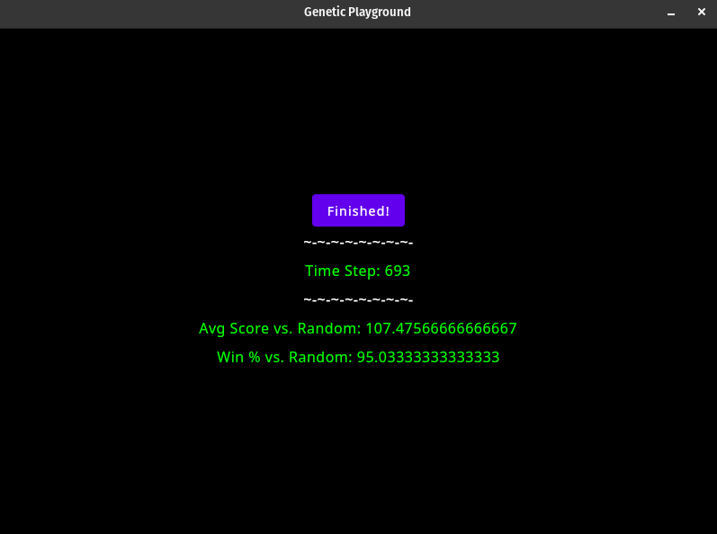

# Genetic Playground

**Description:** Having been inspired by a paper ([*Genetic Algorithms* by John H. Holland](http://www2.econ.iastate.edu/tesfatsi/holland.GAIntro.htm)), I've decided to attempt to make a framework which can solve problems or simulate things using a Genetic Programming approach, as described in the paper above.

### *Playgrounds*

**Prisoner's Dilemma Playground**: A relatively small community of `PrisonersDilemmaPlayer`s is spawned, with each `PrisonersDilemmaPlayer` having random `Characteristics`. Each generation, they each play a game of Iterated [Prisoner's Dilemma](https://en.wikipedia.org/wiki/Prisoner%27s_dilemma) against a random bot. If they win by scoring less than the opponent then they are exceptionally competitive, and get 2 "wins", while getting the same score as an opponent results in "1" win. This rewards `PrisonersDilemmaPlayer`s who can take advantage of those that are safe to take advantage of, while refraining from taking advantage of those they suspect can't be taken advantage of. In short, it's a kind of "Enlightened Self-Interest" game. Those who play it better will "reproduce" faster and pass along the "genes" which made them more successful. Although the GUI is still very rudimentary at this point, by watching the numbers one can observe that even a relatively small pool of a few thousand `PrisonersDilemmaPlayers` will reach a sort of competitive balance very quickly where the pool is better than the totally random average in all measurable cases; the community improves at the game of *Prisoner's Dilemma* by rewarding its citizens for playing *Prisoner's Dilemma*, more or less demonstrating the concept in the *Genetic Algorithms* paper. The next step for this particular `Playground` is to build some rules around which communities of players can evolve in competition with each other, and perhaps influence the internal state of each other. **Important**: For the purposes of this simulation, a "win" is either scoring lower than *or the same as* an opponent. The difference is that the former are rewarded more quickly. **Currently**, a small pool (of about 3k) using a very simple reward system and only fighting against random bots will improve to the point that is exceeds a 90% win-rate (as a population) against randomly-generated bots. There are many ways to refine this further, which I intend to look in to. For this version, unlike the previous version, it is only competing against random bots; the pool does not compete against itself. I will probably continue to tweak the system by which resources are gained in order to make it faster.