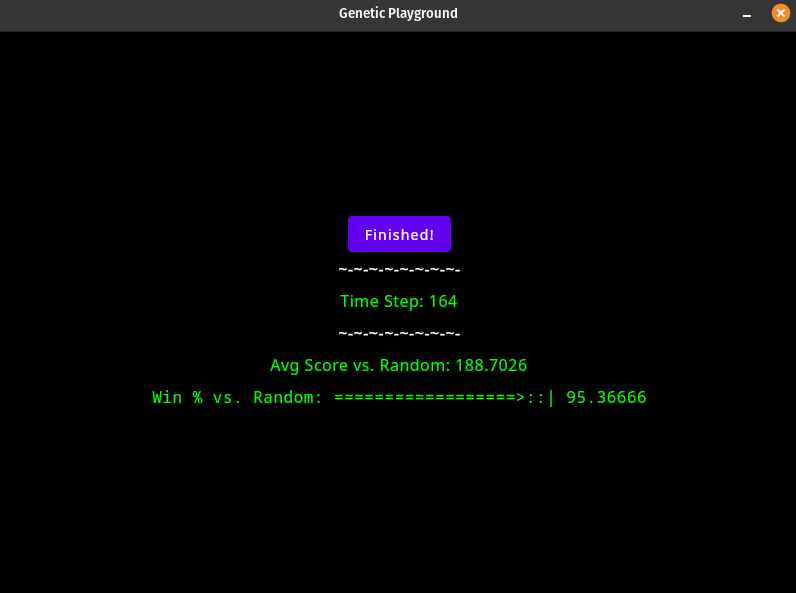

# Genetic Playground

**Description:** Having been inspired by a paper ([*Genetic Algorithms* by John H. Holland](http://www2.econ.iastate.edu/tesfatsi/holland.GAIntro.htm)), I've decided to attempt to make a framework which can solve problems or simulate things using a Genetic Programming approach, as described in the paper above.

### *Playgrounds*

**Prisoner's Dilemma Playground**: In this Playground, a small population of Agents learns to play Iterated [Prisoner's Dilemma](https://en.wikipedia.org/wiki/Prisoner%27s_dilemma). They do this by playing against random bots and against each other, where they are rewarded for success with the resources needed to "reproduce". Agents with better strategies reproduce more quickly while bad ones fall out. **Currently,** a pool of about **3k Agents** can exceed a **95%** win-rate as a group against random bots after about 160 time steps.