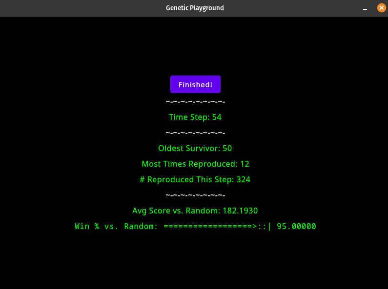

**NOTE**: This project is abandoned for now as I have tackled the project afresh in another attempt [here](https://github.com/sgibber2018/prisoners_dilemma) where I have improved on everything I did here. The project continues there.

# Genetic Playground

**Description:** Having been inspired by a paper ([*Genetic Algorithms* by John H. Holland](http://www2.econ.iastate.edu/tesfatsi/holland.GAIntro.htm)), I've decided to attempt to make a framework which can solve problems or simulate things using a Genetic Programming approach, as described in the paper above.

**Usage and Installation:** This is an IntelliJ IDEA project. The best way to use this is to clone it from within IntelliJ. It should "just work", for the most part, although you may need to mess with a little config and trust the project when prompted to do so. One can run it from within IntelliJ, one can build an executable from within IntelliJ, or if one wants to get straight to the app they can download the .jar file I've included. Although the included .jar is for Linux, one can make executables for Linux, Mac, and Windows by following the instructions [here](https://github.com/JetBrains/compose-jb/blob/master/tutorials/Native_distributions_and_local_execution/README.md) and editing the `build.gradle.kts` file accordingly. I should even be able to make an Android version of it in the future, because the GUI relies on Jetpack Compose.

### *Playgrounds*

**Prisoner's Dilemma Playground**: In this Playground, a small population of Agents learns to play Iterated [Prisoner's Dilemma](https://en.wikipedia.org/wiki/Prisoner%27s_dilemma). They do this by playing against random bots and against each other, where they are rewarded for success with the resources needed to "reproduce". Agents with better strategies reproduce more quickly while bad ones fall out. **Currently,** a pool of about **3k Agents** can exceed a **95%** win-rate as a group against random bots in as little as 45 time steps!
